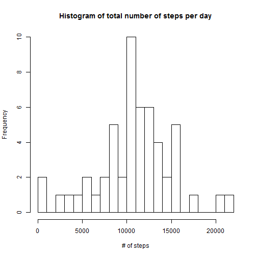
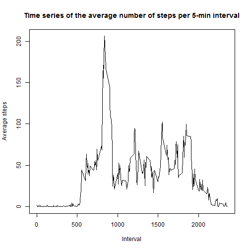
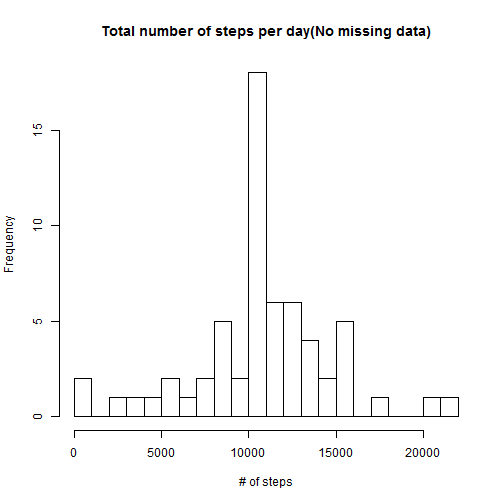
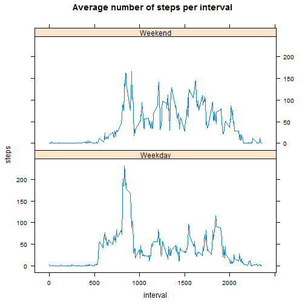

First the data is loaded

```r
dat = read.csv("./data/activity.csv")
```

Figure out sum of steps taken per day

```r
sumdat<-aggregate(steps ~ date, sum, data = dat)
print(sumdat, row.names = FALSE)
```

```
##        date steps
##  2012-10-02   126
##  2012-10-03 11352
##  2012-10-04 12116
##  2012-10-05 13294
##  2012-10-06 15420
##  2012-10-07 11015
##  2012-10-09 12811
##  2012-10-10  9900
##  2012-10-11 10304
##  2012-10-12 17382
##  2012-10-13 12426
##  2012-10-14 15098
##  2012-10-15 10139
##  2012-10-16 15084
##  2012-10-17 13452
##  2012-10-18 10056
##  2012-10-19 11829
##  2012-10-20 10395
##  2012-10-21  8821
##  2012-10-22 13460
##  2012-10-23  8918
##  2012-10-24  8355
##  2012-10-25  2492
##  2012-10-26  6778
##  2012-10-27 10119
##  2012-10-28 11458
##  2012-10-29  5018
##  2012-10-30  9819
##  2012-10-31 15414
##  2012-11-02 10600
##  2012-11-03 10571
##  2012-11-05 10439
##  2012-11-06  8334
##  2012-11-07 12883
##  2012-11-08  3219
##  2012-11-11 12608
##  2012-11-12 10765
##  2012-11-13  7336
##  2012-11-15    41
##  2012-11-16  5441
##  2012-11-17 14339
##  2012-11-18 15110
##  2012-11-19  8841
##  2012-11-20  4472
##  2012-11-21 12787
##  2012-11-22 20427
##  2012-11-23 21194
##  2012-11-24 14478
##  2012-11-25 11834
##  2012-11-26 11162
##  2012-11-27 13646
##  2012-11-28 10183
##  2012-11-29  7047
```

Histogram of the total number of steps taken each day

```r
hist(sumdat$steps, main = "Histogram of total number of steps per day", xlab="# of steps", breaks=20)
```

 

Mean and median of total number of steps per day

```r
cat("Mean of total number of steps per day =",mean(sumdat$steps))
```

```
## Mean of total number of steps per day = 10766.19
```

```r
cat("Median of total number of steps per day =",median(sumdat$steps))
```

```
## Median of total number of steps per day = 10765
```

For getting the average daily pattern activity by interval,  first the mean of the steps for each 5 minute interval across all days  is calculated and recorded in "promint" data frame,  which then is used to plot the time series of the means.

```r
promint<-aggregate(steps ~ interval, mean, data = dat)
plot(promint$interval,promint$steps, type = "l",
     main = "Time series of the average number of steps per 5-min interval", xlab="Interval", ylab="Average steps" )
```

 

We can also find out the 5-minute interval  that on average across all the days in the dataset, contains the maximum number of steps.

```r
maxiter<-promint[which(promint$steps == max(promint$steps)),]
print(maxiter, row.names= FALSE)
```

```
##  interval    steps
##       835 206.1698
```

```r
cat( "At 8:35 hrs. ocurrs the maximun average number of steps taking during a day which is 206.17")
```

```
## At 8:35 hrs. ocurrs the maximun average number of steps taking during a day which is 206.17
```

 <br/>  
  

For treating missing data first let´s find out the number of them,

```r
cat("The total number of missing data in the data set is:",  sum(is.na(dat$steps)))
```

```
## The total number of missing data in the data set is: 2304
```

Each missing data is going to be change for the mean value of the corresponding 5-minute interval across all days in the data set

```r
#Imputing missing values 
mediaint<- ddply(dat,~interval,summarise,mean=mean(steps,na.rm=TRUE)) #data frame with means for each interval
datos1 <-join(dat,mediaint,by="interval") # add the mean for each interval to the original data frame
datos1$steps[which(is.na(dat$steps)==TRUE)]<-datos1$mean[which(is.na(dat$steps)==TRUE)] # change missing data for mean value of interval
datos1$mean <- NULL #drop the mean column
cat( "Now we have a data frame with no missing values")
```

```
## Now we have a data frame with no missing values
```

```r
head(dat) #Head of original data frame
```

```
##   steps       date interval
## 1    NA 2012-10-01        0
## 2    NA 2012-10-01        5
## 3    NA 2012-10-01       10
## 4    NA 2012-10-01       15
## 5    NA 2012-10-01       20
## 6    NA 2012-10-01       25
```

```r
head(datos1) # Head of the transformed  data frame with no missing values
```

```
##       steps       date interval
## 1 1.7169811 2012-10-01        0
## 2 0.3396226 2012-10-01        5
## 3 0.1320755 2012-10-01       10
## 4 0.1509434 2012-10-01       15
## 5 0.0754717 2012-10-01       20
## 6 2.0943396 2012-10-01       25
```

In order to evaluate the impact of imputing the missing data we can compare the following histogram of the total number of steps per day with the one plotted at the beggining of this report.

```r
# Figure out sum of steps taken per day for the data set with no missing data
sumdat1<-aggregate(steps ~ date, sum, data = datos1)
#Histogram of total number of steps per day
hist(sumdat1$steps, main = "Total number of steps per day(No missing data)", xlab="# of steps",breaks=20)
```

 

As can be seen there isn´t an evident change in the pattern of the histograms, however there is an increase in the frequencies of each class for the histogram when imputing missing data.

For the data set with no missing data the mean remains the same and there is a slight change in the median 

```r
cat("Mean of total number of steps per day (No missing data) =",mean(sumdat1$steps))
```

```
## Mean of total number of steps per day (No missing data) = 10766.19
```

```r
cat("Median of total number of steps per day (No missing data) =",median(sumdat1$steps))
```

```
## Median of total number of steps per day (No missing data) = 10766.19
```

<br/> 
Finally we want to find out if there is  any difference in the average number of steps taken on weekdays or  weekends

```r
datos1$dayofweek <- weekdays(as.Date(datos1$date)) # day of the week corresponding to date
datos1$kindofday<-ifelse(datos1$dayofweek=="sábado"|datos1$dayofweek=="domingo","Weekend","Weekday")

promint1<-aggregate(steps ~ interval+kindofday, mean, data = datos1) # Getting means by the kind of day
```

As we can see in the following panel plot of the time series of steps comparing weekdays and weekends, during weekdays there is a peak for the activity before 10:00 hours , whereas during weekends the activity tends to be more distributed during the day hours.

```r
xyplot(steps~interval|kindofday,data=promint1,type = "l", main="Average number of steps per interval",layout=c(1,2) )
```

 

